# DIAGRAMA DE FLUJO - Sistema de Validación Resolución 202

## Diagrama General del Sistema

## Flujo de Validación en Tiempo Real (Worksheet_Change)

```mermaid
flowchart TD
    Start([Usuario modifica celda]) --> Check1{¿Validación activa?}
    Check1 -->|No| Exit1([Salir])
    Check1 -->|Sí| Check2{¿Una sola celda?}
    Check2 -->|No| Exit1
    Check2 -->|Sí| Check3{¿Fila de datos?}
    Check3 -->|No encabezado| Exit1
    Check3 -->|Sí| DisableEvents[Desactivar eventos]

    DisableEvents --> IdentifyCol{Identificar Columna}

    IdentifyCol -->|Col 1: Tipo Doc| V1[ValidarTipoDoc]
    IdentifyCol -->|Col 2: Num Doc| V2[ValidarNumeroDoc]
    IdentifyCol -->|Col 3-6: Nombres| V3[ValidarNombreApellido]
    IdentifyCol -->|Col 7: Fecha Nac| V4[ValidarFechaNac]
    IdentifyCol -->|Col 8: Sexo| V5[ValidarSexoCelda]
    IdentifyCol -->|Col 14: Fecha Cons| V6[ValidarFechaConsulta]
    IdentifyCol -->|Col 11: Régimen| V7[ValidarRegimenCelda]
    IdentifyCol -->|Col 16: Dx| V8[ValidarCodigoDx]
    IdentifyCol -->|Col 31: Gestación| V9[ValidarGestacionCelda]
    IdentifyCol -->|Col 32: Edad Gest| V10[ValidarEdadGestacionalCelda]

    V1 --> Complete[Validación completada]
    V2 --> Complete
    V3 --> Complete
    V4 --> Complete
    V5 --> AutoComplete{¿Sexo = M?}
    V6 --> Complete
    V7 --> Complete
    V8 --> Complete
    V9 --> Complete
    V10 --> Complete

    AutoComplete -->|Sí| ApplyRule[AplicarReglaSexoMasculino]
    AutoComplete -->|No| Complete
    ApplyRule --> Complete

    Complete --> EnableEvents[Reactivar eventos]
    EnableEvents --> Exit2([Fin])
```

## Flujo de Validación de Sexo y Autocompletado

```mermaid
flowchart TD
    Start([ValidarSexoCelda]) --> Normalize[NormalizarSexo]
    Normalize --> Validate{¿Sexo válido M/F/I?}

    Validate -->|No| Error[MarcarError: Rojo]
    Validate -->|Sí| Update[Actualizar valor normalizado]

    Update --> CheckMale{¿Sexo = M?}
    CheckMale -->|No| OK[Celda blanca]
    CheckMale -->|Sí| AutoFill[AplicarReglaSexoMasculino]

    AutoFill --> Deactivate[Desactivar validaciones]
    Deactivate --> Fill1[Gestación = 0]
    Fill1 --> Fill2[Edad Gestacional = 0]
    Fill2 --> Fill3[Control Prenatal = 0]
    Fill3 --> Fill4[Citología = 0]
    Fill4 --> Fill5[Mamografía = 0]
    Fill5 --> Activate[Reactivar validaciones]
    Activate --> AddComment[Agregar comentario]
    AddComment --> OK

    OK --> End([Fin])
    Error --> End
```

## Flujo de Validación Completa (Validar Todo)

```mermaid
flowchart TD
    Start([ValidarTodoElDocumento]) --> Check{¿Hoja DATOS existe?}
    Check -->|No| ErrorMsg[Mensaje: Hoja no encontrada]
    Check -->|Sí| Confirm{¿Confirma validación?}

    Confirm -->|No| Exit1([Cancelar])
    Confirm -->|Sí| Setup[Configurar aplicación]

    Setup --> Disable1[ScreenUpdating = False]
    Disable1 --> Disable2[Calculation = Manual]
    Disable2 --> Disable3[EnableEvents = False]
    Disable3 --> CleanLog[Limpiar log anterior]

    CleanLog --> CountRows[Contar registros]
    CountRows --> CheckEmpty{¿Hay registros?}
    CheckEmpty -->|No| NoData[Mensaje: Sin datos]
    CheckEmpty -->|Sí| InitCounter[erroresEncontrados = 0]

    InitCounter --> LoopStart{Para cada fila}
    LoopStart --> UpdateProgress[Actualizar barra progreso]
    UpdateProgress --> ValidateRow[ValidarFilaCompleta]

    ValidateRow --> V1[1. Tipo de Documento]
    V1 --> V2[2. Número de Documento]
    V2 --> V3[3. Nombres y Apellidos]
    V3 --> V4[4. Fecha de Nacimiento]
    V4 --> V5[5. Sexo]
    V5 --> V6[6. Fecha de Consulta]
    V6 --> V7[7. Coherencia Sexo-Gestación]
    V7 --> V8[8. Coherencia Gestación-EdadGest]
    V8 --> V9[9. Edad Gestacional]
    V9 --> V10[10. Régimen]

    V10 --> CheckError{¿Hay error?}
    CheckError -->|Sí| MarkError[Marcar celda roja]
    CheckError -->|No| NextField

    MarkError --> AddComment[Agregar comentario]
    AddComment --> LogError[RegistrarError en LOG]
    LogError --> IncrementCounter[erroresEncontrados++]
    IncrementCounter --> NextField{¿Más campos?}

    NextField -->|Sí| V1
    NextField -->|No| NextRow{¿Más filas?}
    NextRow -->|Sí| LoopStart
    NextRow -->|No| Restore

    Restore --> Enable1[ScreenUpdating = True]
    Enable1 --> Enable2[Calculation = Auto]
    Enable2 --> Enable3[EnableEvents = True]
    Enable3 --> ClearStatus[Limpiar barra estado]
    ClearStatus --> ShowSummary[MostrarResumenValidacion]

    ShowSummary --> FinalCheck{¿Hay errores?}
    FinalCheck -->|No| SuccessMsg[Mensaje: Validación exitosa]
    FinalCheck -->|Sí| FailMsg[Mensaje: Errores encontrados]
    FailMsg --> ShowLog[Mostrar hoja LOG_ERRORES]

    ShowLog --> End([Fin])
    SuccessMsg --> End
    NoData --> End
    ErrorMsg --> End
```

## Flujo de Reglas de Negocio: Edad vs Tipo Documento

```mermaid
flowchart TD
    Start([ValidarFechaNac]) --> IsDate{¿Es fecha válida?}
    IsDate -->|No| Error[MarcarError: Fecha inválida]
    IsDate -->|Sí| CheckFuture{¿Es futura?}

    CheckFuture -->|Sí| Error
    CheckFuture -->|No| CheckOld{¿> 150 años?}
    CheckOld -->|Sí| Error
    CheckOld -->|No| CalcAge[CalcularEdad]

    CalcAge --> CheckDoc{¿Hay tipo documento?}
    CheckDoc -->|No| Suggest{¿Autocompletar?}
    CheckDoc -->|Sí| ValidateAge[ValidarEdadVsTipoDocumento]

    ValidateAge --> Rule1{¿RC y edad >= 7?}
    Rule1 -->|Sí| Warning1[Advertencia: RC para <7 años]
    Rule1 -->|No| Rule2{¿TI y edad <7 o >=18?}

    Rule2 -->|Sí| Warning2[Advertencia: TI para 7-17 años]
    Rule2 -->|No| Rule3{¿CC y edad <18?}

    Rule3 -->|Sí| Warning3[Advertencia: CC para >=18 años]
    Rule3 -->|No| Rule4{¿MS y edad >=18?}

    Rule4 -->|Sí| Warning4[Advertencia: MS para <18 años]
    Rule4 -->|No| OK[Celda blanca]

    Suggest -->|Sí| CalcSuggestion[SugerirTipoDocumento]
    Suggest -->|No| OK

    CalcSuggestion --> Fill{¿Edad < 7?}
    Fill -->|Sí| SetRC[Tipo = RC]
    Fill -->|No| Check718{¿7-17 años?}
    Check718 -->|Sí| SetTI[Tipo = TI]
    Check718 -->|No| SetCC[Tipo = CC]

    SetRC --> OK
    SetTI --> OK
    SetCC --> OK
    Warning1 --> MarkYellow[Celda amarilla]
    Warning2 --> MarkYellow
    Warning3 --> MarkYellow
    Warning4 --> MarkYellow
    MarkYellow --> End([Fin])
    OK --> End
    Error --> End
```

## Flujo de Coherencia: Gestación

```mermaid
flowchart TD
    Start([ValidarGestacionCelda]) --> Normalize{Normalizar valor}

    Normalize -->|SI o 1| SetYes[Valor = 1]
    Normalize -->|NO o 0| SetNo[Valor = 0]

    SetNo --> AutoNo[AutocompletarNoGestante]
    AutoNo --> FillEdadG[EdadGestacional = 0]
    FillEdadG --> FillControl[ControlPrenatal = 0]

    SetYes --> CheckCoherence
    FillControl --> CheckCoherence{ValidarCoherenciaSexoGestacion}

    CheckCoherence --> GetSex[Obtener sexo fila]
    GetSex --> IsMale{¿Sexo = M?}

    IsMale -->|Sí y Gestación <> 0| Error[MarcarError: Incoherencia]
    IsMale -->|No| CheckEdadG{ValidarCoherenciaGestacionEdadGestacional}

    CheckEdadG --> IsPregnant{¿Gestación = 1?}
    IsPregnant -->|Sí| HasEdadG{¿Tiene EdadGestacional?}
    HasEdadG -->|No o = 0| Error2[Error: Falta EdadGestacional]
    HasEdadG -->|Sí| ValidRange{¿0-42 semanas?}
    ValidRange -->|No| Error3[Error: Rango inválido]
    ValidRange -->|Sí| OK[Celda blanca]

    IsPregnant -->|No| ShouldBeZero{¿EdadGest <> 0?}
    ShouldBeZero -->|Sí| Error4[Error: EdadGest debe ser 0]
    ShouldBeZero -->|No| OK

    OK --> End([Fin])
    Error --> End
    Error2 --> End
    Error3 --> End
    Error4 --> End
```

## Flujo de Registro de Errores

```mermaid
flowchart TD
    Start([RegistrarError]) --> GetLog[Obtener hoja LOG_ERRORES]
    GetLog --> FindLast[Encontrar última fila]
    FindLast --> NewRow[Nueva fila = última + 1]

    NewRow --> WriteDate[Col A: Fecha/Hora = Now]
    WriteDate --> WriteRow[Col B: Número de fila]
    WriteRow --> WriteCol[Col C: Número de columna]
    WriteCol --> WriteField[Col D: Nombre del campo]
    WriteField --> WriteError[Col E: Mensaje de error]
    WriteError --> WriteValue[Col F: Valor ingresado]
    WriteValue --> WriteExpected[Col G: Valor esperado]

    WriteExpected --> End([Fin])
```

## Estructura de Módulos y Dependencias

## Estados de Celda

```mermaid
stateDiagram-v2
    [*] --> Vacía
    Vacía --> EnProceso: Usuario ingresa valor
    EnProceso --> Validando: Dispara Worksheet_Change

    Validando --> Válida: Validación OK
    Validando --> Error: Validación FAIL
    Validando --> Advertencia: Valor atípico

    Válida --> [*]: Celda blanca, sin comentario
    Error --> EnProceso: Usuario corrige
    Advertencia --> EnProceso: Usuario ajusta

    Error --> LogError: Se registra en LOG_ERRORES
    Error --> MarcaRoja: Interior.Color = Rojo
    Error --> Comentario: AddComment(mensaje)

    Advertencia --> MarcaAmarilla: Interior.Color = Amarillo
    Advertencia --> Comentario
```

## Leyenda de Colores

### Códigos de Color Usados

| Color | Código RGB | Uso | Constante VBA |
|-------|-----------|-----|---------------|
| 🔴 Rojo | 255 (255,0,0) | Error que debe corregirse | `COLOR_ERROR` |
| 🟡 Amarillo | 65535 (255,255,0) | Advertencia o valor atípico | `COLOR_ADVERTENCIA` |
| 🟢 Verde claro | 15773696 (0,255,0) | Valor correcto (autocompleto) | `COLOR_CORRECTO` |
| ⚪ Blanco | 16777215 (255,255,255) | Sin errores, estado normal | `COLOR_NORMAL` |

## Resumen del Flujo de Ejecución

### Al Abrir el Archivo
1. `Workbook_Open` → Inicializar sistema
2. Crear menú "VALIDACIÓN 202"
3. Verificar/crear hojas LOG y CONFIG
4. Mostrar mensaje de bienvenida
5. Sistema listo y activo

### Durante el Uso (Tiempo Real)
1. Usuario modifica celda
2. `Worksheet_Change` detecta cambio
3. Identifica columna modificada
4. Ejecuta validación específica
5. Aplica reglas de negocio si corresponde
6. Autocompleta campos relacionados
7. Marca visual (rojo/amarillo/blanco)
8. Registra error en LOG si aplica

### Validación Completa (Manual)
1. Usuario selecciona "Validar Todo"
2. Desactiva actualizaciones de pantalla
3. Recorre TODAS las filas de datos
4. Aplica 10 validaciones por fila
5. Marca errores visualmente
6. Registra cada error en LOG
7. Muestra resumen final
8. Abre hoja LOG si hay errores

### Al Cerrar el Archivo
1. `Workbook_BeforeClose` verifica errores
2. Si hay errores pendientes → Advertencia
3. Usuario confirma o cancela cierre
4. Elimina menú personalizado
5. Cierra archivo

---

## Notas Técnicas

### Variables Globales
- `ValidacionActiva`: Booleano que controla si las validaciones están activas (evita recursión)

### Eventos Críticos
- `Application.EnableEvents = False/True`: Evita bucles infinitos en validaciones
- `Application.ScreenUpdating = False/True`: Mejora rendimiento en validación masiva

### Gestión de Errores
- Todos los procedimientos principales tienen `On Error GoTo ErrorHandler`
- Se restauran configuraciones de Excel incluso si hay error
- Los errores se registran en LOG_ERRORES con timestamp

---

**Sistema desarrollado según Resolución 202 de 2021**
**Ministerio de Salud y Protección Social - Colombia**
